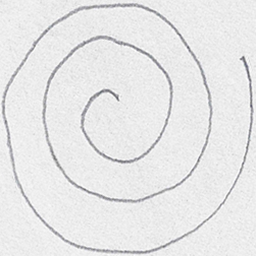
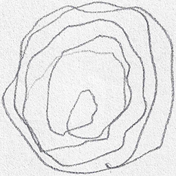

# 🧠 Parkinson's Disease Detection from Spiral & Wave Drawings

This project uses deep learning to detect **Parkinson’s Disease** from hand-drawn **spiral** and **wave** patterns — a clinically significant early sign of motor dysfunction. It includes a **CNN model** trained on augmented image datasets and a user-friendly **Streamlit web app** for real-time predictions.

---

## 📌 Project Highlights

- 🔍 **Binary Classification**: Healthy vs Parkinson  
- 🧠 **Model**: Custom CNN built using TensorFlow & Keras  
- 📈 **Augmented Dataset**: Spiral and wave drawings augmented with transformations  
- 💻 **Web App**: Upload an image and instantly get a prediction  
- 📊 **Visual Analysis**: Accuracy/Loss plots, Confusion Matrix, and classification report  

---

## 📂 Project Structure

```
├── Parkinson's_Disease_Detection.ipynb    # End-to-end model pipeline in notebook  
├── parkinson_disease_detection.h5         # Trained Keras CNN model  
├── parkinson's_disease_detection.py       # Python script for training & evaluation  
├── dectapp.py                             # Streamlit frontend for predictions  
├── train_set.npz                          # Preprocessed training dataset  
├── test_set.npz                           # Preprocessed testing dataset  
├── test_image_healthy.png                 # Sample healthy spiral drawing  
├── test_image_parkinson.png               # Sample parkinsonian spiral drawing  
```

---

## 🧪 Model Architecture

A custom **CNN model** was created with the following architecture:

- **Convolution Layers**: 4 layers with increasing filter sizes (128 → 64 → 32 → 32)  
- **Pooling Layers**: MaxPooling after each Conv layer  
- **Dropout Layers**: To reduce overfitting  
- **Dense Layers**: Final Softmax layer for binary classification  

---

## 📊 Results

- 🔄 Strong generalization due to data augmentation  
- 📉 Detailed confusion matrix and classification report  

### 🔬 Visual Comparison of Input Samples:

| Healthy Drawing | Parkinsonian Drawing |
|------------------|----------------------|
|  |  |

---

## 🚀 How to Run Locally

### 1. Clone the Repository
```bash
git clone https://github.com/your-username/parkinson-detection-cnn.git
cd parkinson-detection-cnn
```

### 2. Install Dependencies
```bash
pip install -r requirements.txt
```

<details>
<summary>📦 Click to view main dependencies</summary>

- `streamlit`  
- `tensorflow`  
- `opencv-python`  
- `scikit-learn`  
- `matplotlib`  
- `seaborn`  

</details>

### 3. Launch the Streamlit App
```bash
streamlit run dectapp.py
```

---

## 🖼️ Sample Predictions (from App)

Upload a drawing (spiral or wave) and see predictions in real time.


---

## 🧠 Dataset

- Collected spiral and wave images from clinical references  
- Resized, grayscale-converted, normalized  
- Augmented using rotations and flips  
- Labels encoded using `LabelEncoder` and one-hot encoded  

---

## 📈 Training Pipeline

- Data loading from `.npz` files  
- Augmentation using `ImageDataGenerator`  
- Preprocessing: resize (128x128), grayscale conversion  
- CNN training for 70 epochs using Adam optimizer  
- Accuracy and loss visualization  
- Final evaluation via confusion matrix and metrics  

---

## 🏁 Future Work

- Expand dataset with more clinically verified samples  
- Incorporate tremor severity grading  
- Real-time sketching pad integration  

---

## 📃 License

This project is open-source and free to use under the MIT License.

---

## 🙌 Acknowledgements

- Spiral drawings are clinically proven indicators of motor control deterioration in Parkinson’s Disease.  
- This project is inspired by real-world applications of computer vision in healthcare.
